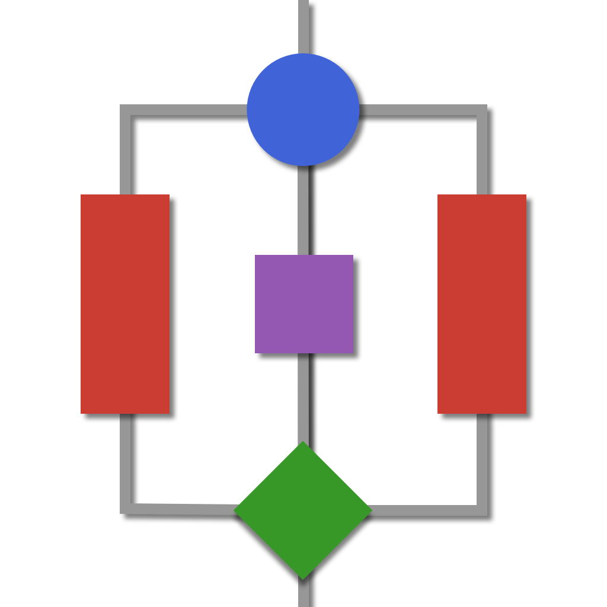

<p align="center">
  <a href="" rel="noopener">
 </a>
</p>

<h3 align="center">AlgorithmCollection.jl</h3>

<div align="center">

| **Documentation**                                                               | **Build Status**                                                                                |
|:-------------------------------------------------------------------------------:|:-----------------------------------------------------------------------------------------------:|
|[](https://Anselmoo.github.io/ClassicAlgorithmsCollections/stable) [](https://Anselmoo.github.io/ClassicAlgorithmsCollections/dev)| [](https://github.com/Anselmoo/ClassicAlgorithmsCollections/actions) [](https://travis-ci.com/Anselmoo/ClassicAlgorithmsCollections) [](https://codecov.io/gh/Anselmoo/ClassicAlgorithmsCollections)|


</div>

---

<p align="center"> A set of classic and modern algorithm reimplementated in JULIA.
    <br> 
</p>

## 📝 Table of Contents

- [About](#about)
- [Getting Started](#getting_started)
- [Deployment](#deployment)
- [Usage](#usage)
- [Example](#example)
- [TODO](../TODO.md)
- [Contributing](CONTRIBUTING.md)
- [Authors](#authors)
- [Acknowledgments](#acknowledgement)

## 🧐 About the `AlgorithmCollection.jl` <a name = "about"></a>

`AlgorithmCollection.jl` is a reimplementation of classic computer algorithms in `JULIA`. The main focus is to combine and highlight the three major benefits of `JULIA`:
1. Functionality
2. Performance
3. Maintainability

## 🏁 Getting Started <a name = "getting_started"></a>

ClassicAlgorithmsCollections is a registered package and so can be installed via `Pkg.add`.

```julia
Pkg.add("ClassicAlgorithmsCollections")
```

This package supports Julia `≥1.5`.

### 🎚 Usage <a name = "usage"></a>
To use ```ClassicAlgorithmsCollections.jl``` in your project,

```julia
using ClassicAlgorithmsCollections
```

### 📚 Accessing Documentation from REPL
All docs found here can also be accessed via REPL through Julia's help functionality.
```julia-repl
julia> using ClassicAlgorithmsCollections
```

## Example: *The binary pivot search* <a name = "example"></a>
```julia
julia> import ClassicAlgorithmsCollections
julia> arr = [2, 5, 4, 7, 2, 8, 9, 3, 10, 2]
julia> target = 3
julia> ClassicAlgorithmsCollections.binary_pivot_search(arr, target)
8
```
## ⚙️ Built Using <a name = "built_using"></a>

- [Julia](https://github.com/JuliaLang/julia) - Language

## ✍️ Authors <a name = "authors"></a>


See also the list of [contributors](https://github.com/kylelobo/The-Documentation-Compendium/contributors) who participated in this project.

## 🎉 Acknowledgements <a name = "acknowledgement"></a>
- [@Geeksforgeeks](https://www.geeksforgeeks.org/top-10-algorithms-in-interview-questions/)
- [@kylelobo](https://github.com/connietran-dev/readme-generator) For the **README.md** generator
